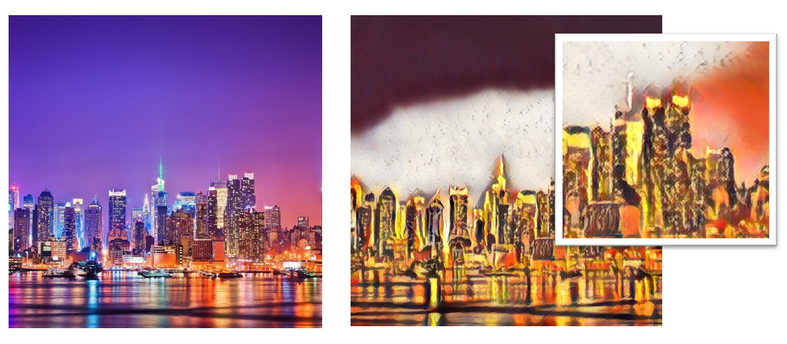

# 🎨 DIB-TIST: Dynamic Image Blending for Enhancement of Text-based Image Style Transfer

Official implementation of our **CVIP 2025** paper:  
**"DIB-TIST: Dynamic Image Blending for Enhancement of Text-based Image Style Transfer"**

## 📑 Paper
📄 [Read the paper (PDF)](paper/DBIST_CVIP_2025.pdf)

---

## 📄 Abstract
Text-based image style transfer (TIST) enables users to define styles through natural language descriptions.  
However, existing methods like **MMIST** often struggle with **foreground-background separation**, resulting in blurred edges.  

We propose **DIB-TIST**, a novel method that dynamically blends content features into the stylized output using a **contextual-loss–based adaptive weight**.  
This improves structural preservation while maintaining artistic fidelity.  

📊 Our method achieved:
- **SSIM = 0.606**  
- **GMD = 0.394**  
on the Flickr30k benchmark, outperforming MMIST.

---

## 🚀 Key Contributions
- 🔹 Dynamic blend-weight controlled by contextual loss  
- 🔹 Improved edge preservation in stylized outputs  
- 🔹 Extensive experiments with multiple text-driven styles  
- 🔹 Open-source implementation with reproducible results  

---

## 🔍 Motivation
Existing **MMIST** outputs often suffer from blurred edges and weak foreground-background separation:  

  

*Left: Content Image | Right: MMIST Output (blurred edges highlighted)*

---

## 📊 Results: Hyperparameter tuning (λ values)

  

